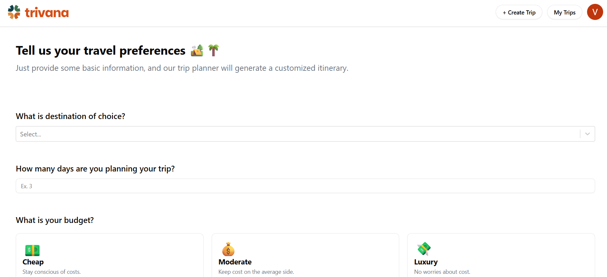
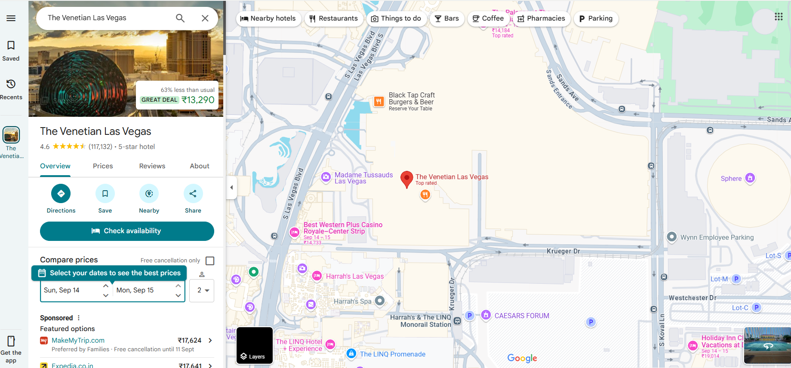

# 🌍 Trivana – AI Trip & Itinerary Planner

Trivana is a full-stack AI-powered travel planner that allows users to generate smart, personalized itineraries using **Gemini AI**. Built with **React**, **Firebase**, and **TailwindCSS**, Trivana provides a fast and intuitive travel planning experience — from destination selection to full itinerary generation.

---

## 🚀 Features

- 🔐 Secure login with Google OAuth using Firebase Authentication  
- 🧠 AI-powered itinerary generation via Gemini AI based on user preferences  
- 🏨 Google Places API integration for hotel and activity suggestions  
- ✨ Real-time trip customization and dynamic itinerary preview  
- 📱 Fully responsive design built with Tailwind CSS  
- 💾 User-specific trip storage and history in Firebase (My Trips)

---

## 🛠️ Tech Stack

- **Frontend:** React.js, Tailwind CSS  
- **Backend:** Firebase Firestore, Firebase Authentication  
- **AI Integration:** Gemini AI (Google)  
- **APIs Used:** Google Places API  

---

## 🌐 Live Project

🔗 [Visit Trivana Live](https://trivana-lac.vercel.app)

---

## 🖼️ Preview Screenshots

### 🏠 Home Page  
  


---

### 🧭 Create Trip Page  
  


---

### 📄 View Trip Page  
  
  
  
  


---

### 🧳 My Trips Page  


---

## 🧪 Setup & Run Locally

### 1. Clone the Repository

```bash
git clone https://github.com/veerasubandh/Trivana.git
cd Trivana
